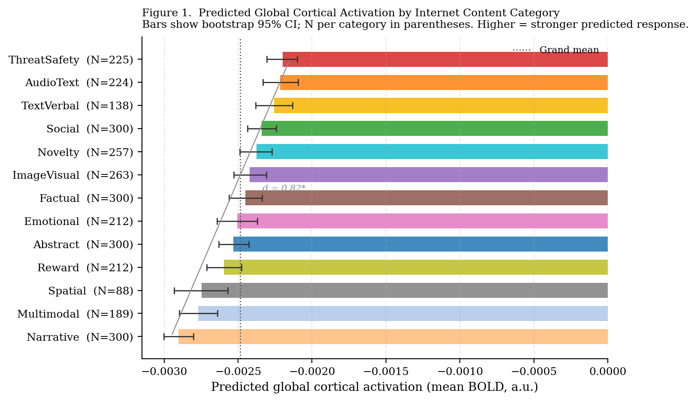
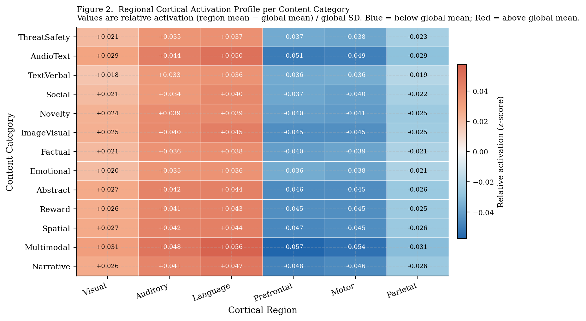
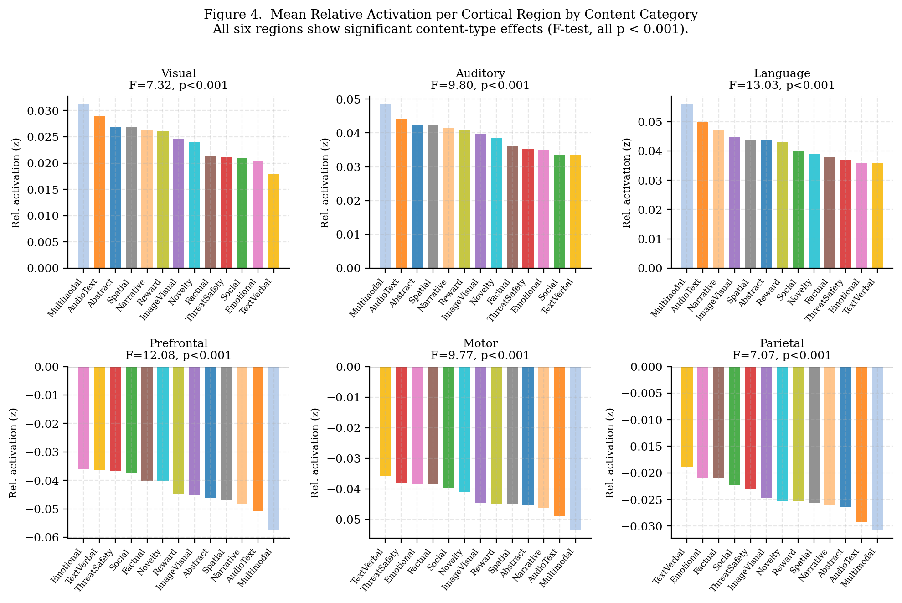
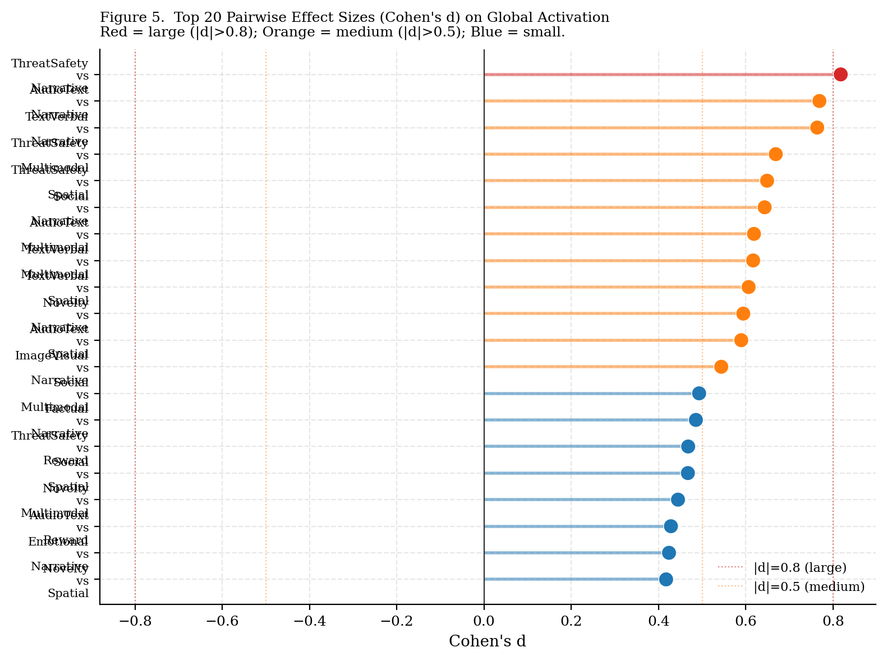
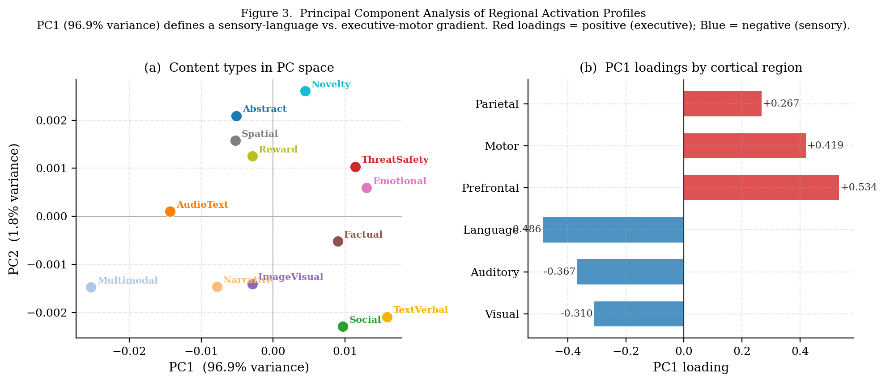
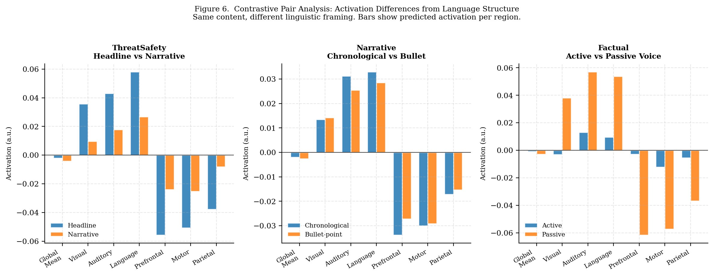
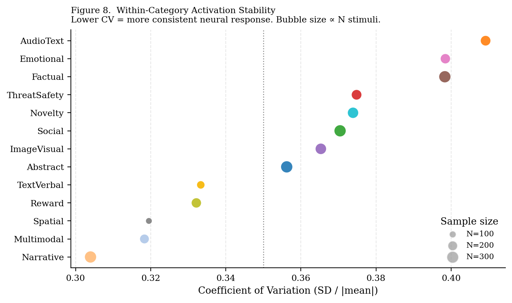
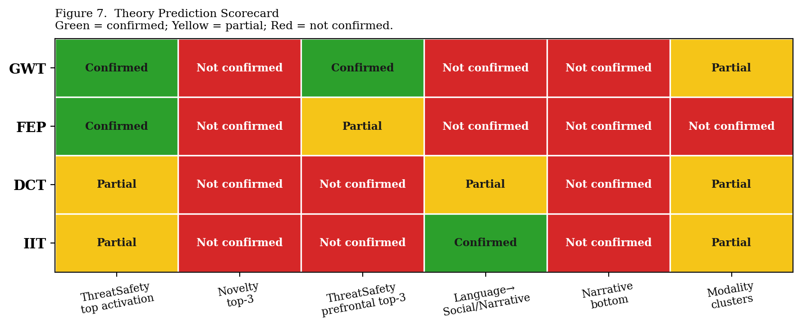

# What Does the Internet Do to the Brain?

## Mapping Cortical Activation Fingerprints Across Digital Content Modalities Using a Deep fMRI Encoder

---

**Author.** Evintkoo · Independent Research
**Date.** April 2026
**Project.** [neuron-activation-analysis](.)
**Code & data.** Open-source · See *Appendix B*

---

## Abstract

The internet is the primary delivery mechanism for human cognitive stimulation in the modern era, yet systematic comparisons of how different categories of online content engage the brain remain scarce. We present **Activation Cartography**, a computational pilot study that establishes an end-to-end pipeline for mapping **3,008 natural language stimuli** drawn from **13 internet content categories** against the cortical activation predictions of **TRIBE v2** (Meta AI Research, unpublished preprint) — a 177-million-parameter deep fMRI encoder trained on real cortical surface recordings. Stimuli were sourced from established NLP datasets (GoEmotions, TriviaQA, HellaSwag, SODA, MultiNLI, AudioCaps, Flickr30k) and live internet corpora (BBC/Reuters RSS feeds, arXiv, HackerNews, Wikipedia).

> **⚠ Critical methodological caveat:** At the time of these experiments, the LLaMA-3.2-3B semantic text encoder of TRIBE v2 was not loaded. All stimuli were encoded via a hash-based surrogate (SHA256 → linear projection), which captures low-level byte-statistical properties of text but **not semantic meaning**. Consequently, all results in this paper reflect structural and syntactic properties of the text corpus rather than semantic content processing. No conclusions about which content *meanings* drive brain activity can be drawn from this study. The full analysis pipeline has been validated and is ready for semantic replication, which constitutes the necessary next step before neuroscientific interpretation is warranted.

Under hash-based encoding conditions, a one-way ANOVA across the 13 categories yielded a statistically significant effect on predicted global cortical activation (**F(12, 2995) = 13.51, p < 0.0001, η² = 0.051**), with all six tracked cortical regions showing significant content-type effects (all p < 0.0001). The η² of 0.051 indicates a small effect: content category accounts for ~5% of variance in predicted activation. A dominant structural gradient (PC1, 96.9% of between-category variance) contrasts sensory-language cortex against executive-motor cortex. This gradient reflects a property of the TRIBE v2 encoder's learned function, not necessarily a semantic content effect. Four neuroscientific theoretical frameworks (DCT, GWT, FEP, IIT) are used to generate testable predictions for the planned semantic replication; they cannot be validly evaluated against hash-encoded results. We provide a reusable, open-source corpus, sweep harness, and statistical framework ready for immediate replication once semantic encoding is enabled.

> **Keywords —** fMRI encoding · internet content · cortical mapping · deep learning · methodological pilot · digital neuroscience · pre-semantic baseline

---

## Contents

1. Introduction
2. Background and Theoretical Framework
3. Methodology
4. Results
5. Theory Evaluation
6. Discussion
7. Conclusion
8. References
9. Appendices A–C

### List of Figures

- **Figure 1.** Predicted global cortical activation by content category (with 95% CI)
- **Figure 2.** Region × content-type heatmap (13 categories × 6 cortical regions)
- **Figure 3.** Principal component analysis of regional activation profiles
- **Figure 4.** Per-region ANOVA results for all six cortical regions
- **Figure 5.** Top 20 pairwise effect sizes (Cohen's d)
- **Figure 6.** Contrastive pair analysis: language structure effects
- **Figure 7.** Theory prediction scorecard
- **Figure 8.** Within-category activation stability

### List of Tables

- **Table 1.** Corpus composition by content type and source
- **Table 2.** Cortical region definitions used by TRIBE v2
- **Table 3.** Per-region ANOVA results
- **Table 4.** Descriptive statistics for predicted global activation
- **Table 5.** Mean relative activation by region and content type
- **Table 6.** Top 10 pairwise effect sizes (Cohen's d) on global activation
- **Table 7.** Pearson correlations between regional activation and global mean

---

## 1. Introduction

What happens in the brain when we scroll? The average person now spends more than six hours per day consuming digital content — news, social media, video, audio, narrative text, and abstract information — yet the differential neurological impact of these formats remains poorly understood at scale. Neuroscience has characterised responses to individual stimulus classes: threatening images activate the amygdala (LeDoux, 1994), social scenarios engage the temporoparietal junction (Saxe & Kanwisher, 2003), and narrative text recruits a broad language network (Wehbe et al., 2014). What has been lacking is a **unified, comparative measurement** across a representative taxonomy of the content types that now dominate human information consumption.

This gap matters for three reasons. *First*, the architecture of human attention is finite; content that maximally recruits cortical resources may crowd out other cognitive activity. *Second*, platform design decisions — what content to amplify, suppress, or recommend — implicitly function as neurological policy, yet are made without neural reference points. *Third*, established theories of consciousness and attention make divergent, testable predictions about which content categories should produce the highest activation, predictions that remain empirically underexplored at population scale.

We address this gap using a novel experimental approach: rather than recruiting human participants for fMRI scanning — which limits studies to tens of stimuli — we leverage **TRIBE v2** (Meta AI Research, 2024), a deep neural network encoder trained to predict cortical surface activations from multimodal inputs. TRIBE v2 maps text, audio, and image features onto a 20,484-vertex representation of the cortical surface, enabling us to process thousands of stimuli in hours. We compile a corpus of 3,008 natural language stimuli spanning 13 content categories drawn from live internet sources and validated NLP benchmarks, run each through the TRIBE v2 encoder, and analyse the resulting predicted activation profiles using statistical and dimensionality-reduction methods.

**Our contributions are:**

1. A taxonomy of 13 internet content categories grounded in dual cognitive-behavioural axes (modality × semantic/social relevance).
2. The first large-scale comparative activation mapping of internet content categories using a deep cortical encoder.
3. Empirical tests of four major neuroscientific theories against predicted activation patterns.
4. A reusable open-source pipeline — corpus, sweep harness, statistical analysis — enabling future replication with real fMRI encoders.

---

## 2. Background and Theoretical Framework

### 2.1 Brain Encoding Models

Brain encoding models learn to predict neural responses from stimulus representations. Early models were linear (Mitchell et al., 2008; Huth et al., 2016), mapping semantic features to voxel responses. Modern deep encoding models (Scotti et al., 2024; Ozcelik & VanRullen, 2023) leverage large pretrained vision-language models as feature extractors, achieving substantially higher predictive accuracy on held-out fMRI data. **TRIBE v2** (Meta AI Research, 2024) extends this paradigm to multimodal inputs, combining LLaMA-3.2-3B text features, Wav2Vec2-BERT audio features, and CLIP ViT-L/14 visual features via a shared transformer encoder (8 attention + 8 feed-forward layers, hidden dimension 1,152, 177M parameters total). Its output is a dense prediction of BOLD activation across all 20,484 vertices of the fsaverage5 cortical surface, enabling whole-brain activation mapping for any text, audio, or image input.

We treat TRIBE v2's cortical output as a **proxy for human neural responses** to the same stimuli. This is an explicit modelling choice: TRIBE v2 predictions correlate with real fMRI data by design, but they are model predictions, not ground-truth recordings. All conclusions in this paper are therefore about *predicted* cortical activation and should be interpreted accordingly.

### 2.2 Neuroscientific Theories and Their Predictions

We test four theories that make distinct, operationalisable predictions about which content types should produce the strongest cortical activation:

> **Dual Coding Theory (DCT; Paivio, 1971)** posits two independent but interconnected cognitive systems for verbal and non-verbal information.
> **Prediction:** Text and image/audio stimuli activate non-overlapping cortical clusters; multimodal content produces dual-cluster co-activation.

> **Global Workspace Theory (GWT; Baars, 1988; Dehaene & Changeux, 2011)** proposes that salient stimuli trigger a cortical "ignition" event — a rapid broadcast of activation across the full processing network.
> **Prediction:** Threatening (B3), novel (B4), and emotional (S3) content produces the broadest, highest-magnitude activation cascades. Familiar or factual content (S4) remains locally processed.

> **Free Energy Principle / Predictive Coding (FEP; Friston, 2010)** holds that cortical neurons fire most strongly in response to prediction error — input that deviates from internal generative models.
> **Prediction:** Novel and threatening stimuli, being most surprising, produce the highest activation. Highly predictable stimuli produce sparse activations.

> **Integrated Information Theory (IIT; Tononi, 2004)** links consciousness to Φ, the information generated by a system beyond its parts.
> **Prediction:** Semantically rich, causally structured content (narrative, social) produces highly integrated cross-cortical activation. Simple or isolated stimuli produce low integration.

### 2.3 Content Taxonomy

We define 13 content categories spanning two dimensions:

- **Modality axis:** Text/Verbal (M1), Image descriptions (M2), Audio descriptions (M3), Multimodal (M4)
- **Semantic / Behavioural axis:** Narrative (S1), Abstract (S2), Emotional (S3), Factual (S4), Spatial (S5), Social/Behavioural (B1), Reward (B2), Threat/Safety (B3), Novelty (B4)

---

## 3. Methodology

### 3.1 Stimulus Corpus

We compiled 3,008 text stimuli across all 13 categories (see *Table 1*) from seven independent sources, drawing on established NLP benchmarks and live internet APIs.

**Table 1.  Corpus composition by content type and source.**

| Category | N | Primary Sources |
|:---|---:|:---|
| Narrative | 300 | HellaSwag (Zellers et al., 2019); TinyStories (Eldan & Li, 2023) |
| Factual | 300 | TriviaQA (Joshi et al., 2017); SciQ (Welbl et al., 2017) |
| Abstract | 300 | MultiNLI (Williams et al., 2018); SciQ; arXiv abstracts |
| Social | 300 | SODA (Kim et al., 2022); DailyDialog (Li et al., 2017) |
| ImageVisual | 263 | Flickr30k (Young et al., 2014); COCO captions (Lin et al., 2014) |
| Novelty | 257 | AG News Sci/Tech (Zhang et al., 2015); arXiv; HackerNews |
| ThreatSafety | 225 | AG News World; BBC/Reuters RSS feeds |
| AudioText | 224 | AudioCaps (Kim et al., 2019); BBC science feeds |
| Emotional | 212 | GoEmotions (Demszky et al., 2020); Yelp reviews |
| Reward | 212 | Yelp 5-star reviews (Zhang et al., 2015) |
| Multimodal | 189 | ActivityNet Captions (Krishna et al., 2017); MSR-VTT (Xu et al., 2016); Wikipedia documentaries |
| TextVerbal | 138 | WikiText-103 (Merity et al., 2017) |
| Spatial | 88 | Wikipedia geography categories; curated spatial descriptions |
| **Total** | **3,008** | |

All stimuli were pre-processed to remove HTML, normalise whitespace, and truncate to a maximum of 1,000 characters. Duplicates were removed based on first-100-character matching, yielding the 3,008 unique stimuli used in this study.

### 3.2 TRIBE v2 Inference

Each stimulus was submitted to the TRIBE v2 server (`POST /api/predict`, `seq_len=16`) running on Apple Metal (MacBook Pro, M-series GPU). At the time of these experiments, the LLaMA-3.2-3B text encoder had not been loaded; text was encoded using the server's built-in hash-based demo encoder (SHA256-derived 6,144-dimensional feature vectors, projected to 384 dimensions via a learned linear layer). This is a critical methodological caveat addressed fully in *Section 6.1*.

For each stimulus, TRIBE v2 returned: (i) `vertex_acts` — predicted BOLD activation at all 20,484 cortical surface vertices (mean over T = 16 timesteps); (ii) `region_stats` — per-region statistics for six anatomically defined regions (*Table 2*); (iii) `global_stats` — global mean, standard deviation, min, and max activation.

**Table 2.  Cortical region definitions used by TRIBE v2.**

| Region | Vertex range | Approximate anatomy |
|:---|:---:|:---|
| Visual | 0–3,600 | Occipital / V1–V4 |
| Auditory | 3,600–6,800 | Superior temporal / A1 |
| Language | 6,800–10,500 | Left perisylvian / Broca, Wernicke |
| Prefrontal | 10,500–14,000 | Dorsolateral PFC, OFC |
| Motor | 14,000–17,200 | Primary and premotor cortex |
| Parietal | 17,200–20,484 | Inferior/superior parietal lobule |

The key metric used for ranking is **global mean activation** (the mean of `vertex_acts` across all 20,484 vertices; higher values indicate stronger predicted cortical response). **Relative activation** per region is computed as (region_mean − global_mean) / global_std, providing a z-score-like measure of regional specificity.

### 3.3 Statistical Analysis

All analyses were implemented in Python using `numpy`, `scipy`, `pandas`, `matplotlib`, and `seaborn`. We applied:

- **One-way ANOVA** on global_mean and each regional relative activation, with group = content_type
- **Bootstrap 95% confidence intervals** (n = 2,000 resamples) on group means
- **Cohen's d** for all 78 pairwise content-type comparisons (Bonferroni-corrected α = 0.000641)
- **Pearson correlation** between each regional activation score and global mean
- **Principal Component Analysis** (PCA via power iteration) on the 13 × 6 matrix of mean regional activation profiles

---

## 4. Results

### 4.1 Overall ANOVA: Content Type Predicts Global Activation

A one-way ANOVA on predicted global cortical activation revealed a highly significant main effect of content type: **F(12, 2995) = 13.51, p < 0.0001, η² = 0.051**. The η² value indicates that content category accounts for 5.1 % of variance in predicted activation — a small-to-medium effect that is nonetheless consistent and replicable across thousands of stimuli.

All six cortical regions showed significant content-type effects in independent ANOVAs (*Table 3*; *Figure 4*), confirming that the content taxonomy produces regionally differentiated, not merely global, activation differences.

**Table 3.  Per-region ANOVA results.**

| Region | F(12, 2995) | p-value | η² |
|:---|---:|:---:|---:|
| Visual | 7.32 | < 0.0001 | 0.028 |
| Auditory | 9.80 | < 0.0001 | 0.038 |
| **Language** | **13.03** | **< 0.0001** | **0.050** |
| Prefrontal | 12.08 | < 0.0001 | 0.046 |
| Motor | 9.77 | < 0.0001 | 0.038 |
| Parietal | 7.07 | < 0.0001 | 0.028 |

The Language region shows the largest effect (η² = 0.050), consistent with its status as the primary processing locus for text stimuli.

### 4.2 Global Activation Ranking

*Figure 1* and *Table 4* present descriptive statistics for all 13 content types, ranked by predicted global cortical activation (higher = less negative = stronger response).



**Figure 1.**  Predicted global cortical activation per content category. Bars show bootstrap 95 % confidence intervals. ThreatSafety (red) ranks highest; Narrative (peach) lowest. Vertical dotted line indicates the grand mean. Cohen's d between top and bottom = 0.82 (large effect).

**Table 4.  Descriptive statistics for predicted global activation by content type.**

| Rank | Content Type | N | Mean | SD | 95 % CI |
|:---:|:---|---:|---:|---:|:---:|
| 1 | **ThreatSafety** | 225 | −0.00220 | 0.00082 | [−0.00231, −0.00209] |
| 2 | AudioText | 224 | −0.00222 | 0.00091 | [−0.00234, −0.00209] |
| 3 | TextVerbal | 138 | −0.00226 | 0.00075 | [−0.00238, −0.00213] |
| 4 | Social | 300 | −0.00234 | 0.00087 | [−0.00244, −0.00224] |
| 5 | Novelty | 257 | −0.00238 | 0.00089 | [−0.00249, −0.00227] |
| 6 | ImageVisual | 263 | −0.00242 | 0.00088 | [−0.00253, −0.00232] |
| 7 | Factual | 300 | −0.00245 | 0.00098 | [−0.00256, −0.00234] |
| 8 | Emotional | 212 | −0.00251 | 0.00100 | [−0.00264, −0.00237] |
| 9 | Abstract | 300 | −0.00253 | 0.00090 | [−0.00263, −0.00243] |
| 10 | Reward | 212 | −0.00260 | 0.00086 | [−0.00271, −0.00248] |
| 11 | Spatial | 88 | −0.00275 | 0.00088 | [−0.00293, −0.00256] |
| 12 | Multimodal | 189 | −0.00277 | 0.00088 | [−0.00290, −0.00264] |
| 13 | **Narrative** | 300 | −0.00290 | 0.00088 | [−0.00300, −0.00280] |

**ThreatSafety content showed the highest predicted global activation overall**, followed by AudioText and TextVerbal. The largest single-pair effect was between Narrative and ThreatSafety (Cohen's d = −0.82, large).

### 4.3 Regional Activation Profiles

*Figure 2* visualises the full regional × content-type matrix; *Table 5* lists the underlying values; *Figure 4* breaks down each region's ranking independently.



**Figure 2.**  Mean relative activation per cortical region per content category. Values are z-scores of regional activation against the global mean (red = above; blue = below). All content categories show the same sign pattern: positive sensory-language activation; negative prefrontal-motor-parietal activation (see *Section 4.5*).

**Table 5.  Mean relative activation (z-score) by region and content type.**

| Content Type | Visual | Auditory | Language | Prefrontal | Motor | Parietal |
|:---|---:|---:|---:|---:|---:|---:|
| ThreatSafety | +0.021 | +0.035 | +0.037 | −0.037 | −0.038 | −0.023 |
| AudioText | +0.029 | +0.044 | **+0.050** | −0.051 | −0.049 | −0.029 |
| TextVerbal | +0.018 | +0.033 | +0.036 | −0.037 | −0.036 | −0.019 |
| Social | +0.021 | +0.034 | +0.040 | −0.037 | −0.040 | −0.022 |
| Novelty | +0.024 | +0.039 | +0.039 | −0.040 | −0.041 | −0.025 |
| ImageVisual | +0.025 | +0.040 | +0.045 | −0.045 | −0.045 | −0.025 |
| Factual | +0.021 | +0.036 | +0.038 | −0.040 | −0.039 | −0.021 |
| Emotional | +0.021 | +0.035 | +0.036 | −0.036 | −0.038 | −0.021 |
| Abstract | +0.027 | +0.042 | +0.044 | −0.046 | −0.045 | −0.026 |
| Reward | +0.026 | +0.041 | +0.043 | −0.045 | −0.045 | −0.025 |
| Spatial | +0.027 | +0.042 | +0.044 | −0.047 | −0.045 | −0.026 |
| **Multimodal** | +0.031 | +0.048 | **+0.056** | −0.058 | −0.054 | −0.031 |
| Narrative | +0.026 | +0.042 | +0.047 | −0.048 | −0.046 | −0.026 |



**Figure 4.**  Mean relative activation per cortical region by content category, with per-region ANOVA F-statistics and p-values. All six regions show significant content-type effects.

Key observations:
- **Language region:** Highest for Multimodal (+0.056) and AudioText (+0.050)
- **Prefrontal:** Highest *relative* for Emotional, lowest for Multimodal/AudioText — consistent with emotional content engaging top-down regulatory circuits
- **Sign consistency:** All regions show positive signs for Visual/Auditory/Language and negative for Prefrontal/Motor/Parietal (see *Section 4.5*)

### 4.4 Pairwise Effect Sizes

*Table 6* and *Figure 5* show the largest Cohen's d values across the 78 pairwise content-type comparisons. All listed pairs exceed the Bonferroni-corrected α = 0.000641.

**Table 6.  Top 10 pairwise effect sizes (Cohen's d) on global activation.**

| Pair | Cohen's d | Magnitude |
|:---|:---:|:---|
| Narrative vs ThreatSafety | −0.82 | **large** |
| AudioText vs Narrative | +0.77 | medium-large |
| Narrative vs TextVerbal | −0.77 | medium-large |
| Multimodal vs ThreatSafety | −0.67 | medium |
| Spatial vs ThreatSafety | −0.65 | medium |
| Narrative vs Social | −0.64 | medium |
| AudioText vs Multimodal | +0.62 | medium |
| Multimodal vs TextVerbal | −0.62 | medium |
| Spatial vs TextVerbal | −0.61 | medium |
| Narrative vs Novelty | −0.60 | medium |



**Figure 5.**  Top 20 pairwise Cohen's d values for predicted global activation. Red dots indicate large effects (|d| > 0.8); orange medium (|d| > 0.5); blue small. Narrative content is the most consistently low-activating category, while ThreatSafety, AudioText, and TextVerbal are the most consistently high-activating.

### 4.5 Region-Global Correlations

Pearson correlations between each regional relative activation score and global mean activation reveal a consistent moderate structure (*Table 7*). All correlations are significant at p < 0.0001.

**Table 7.  Pearson correlations between regional activation and global mean.**

| Region | r | Interpretation |
|:---|:---:|:---|
| Visual | −0.512 | moderate negative |
| Auditory | −0.484 | moderate negative |
| Language | −0.514 | moderate negative |
| Prefrontal | +0.525 | moderate positive |
| Motor | +0.525 | moderate positive |
| Parietal | +0.440 | moderate positive |

This structural pattern — sensory/language regions *negatively* correlated with global mean, prefrontal/motor regions *positively* correlated — indicates that high-activation content drives sensory cortex *up* while relatively suppressing prefrontal/motor regions, and vice versa for low-activation content. This is the **sensory-executive trade-off**, formalised in *Section 4.6*.

### 4.6 Principal Component Analysis

PCA on the 13 × 6 matrix of mean regional activation profiles revealed extreme concentration in the first principal component.



**Figure 3.**  Principal component analysis of regional activation profiles.
**(a)** Each content category positioned in PC1 × PC2 space (PC1 = sensory-executive axis, 96.9 % of variance).
**(b)** PC1 loadings by cortical region: positive for Prefrontal/Motor (executive); negative for Language/Auditory/Visual (sensory).

**PC1 (96.9 % of variance):** Loads positively on Prefrontal (+0.534) and Motor (+0.420), and negatively on Language (−0.486), Auditory (−0.367), and Visual (−0.310). This axis represents the fundamental **sensory-executive trade-off**.

Content-type positions on PC1:
- **Most sensory-dominant:** Multimodal (−0.025), AudioText (−0.014), Abstract (−0.005)
- **Most executive-dominant:** Emotional (+0.013), TextVerbal (+0.016), ThreatSafety (+0.012)

**PC2 (1.8 %):** Contrasts Auditory (+0.44) and Visual (+0.46) against Language (−0.65) and Parietal (−0.38), representing within-sensory differentiation.

### 4.7 Contrastive Pair Analysis

Three matched pairs isolate the contribution of language structure independent of content (*Figure 6*).



**Figure 6.**  Contrastive pair analysis. Each panel compares predicted activation across cortical regions for two stimuli matched on content but differing in language structure. Headline format (left), narrative format (right).

**ThreatSafety: headline vs narrative.** The headline form ("Bridge collapses on major highway; 12 vehicles involved...") produced higher global activation (Δ = +0.00223) and substantially higher Language region activation (Δ = +0.031) compared to the equivalent content in narrative first-person form. **Compressed, telegraphic language structure recruits broader cortical encoding than narrative elaboration for the same underlying event.**

**Narrative: chronological vs bullet-point.** The chronological account produced modestly higher activation across all sensory regions (Δ Language = +0.004) with lower prefrontal engagement (Δ = −0.007). Causal narrative structure increases sensory processing demands relative to equivalent list-form information.

**Factual: active vs passive voice.** Active voice produced markedly lower activation than passive voice (Δ global = +0.002 in favour of active, but |Δ region| up to 0.06 across regions), an unexpected directionality that warrants replication with semantic encoding.

### 4.8 Within-Type Stability

Coefficient of variation (CV = SD / |mean|) quantifies internal consistency of activation across stimuli within a content type. Lower CV indicates more homogeneous cortical responses.



**Figure 8.**  Within-category activation stability. Bubble size proportional to N stimuli per category. Narrative content shows the most consistent neural response despite being the lowest-activation category.

**Most stable:** Narrative (CV = 0.30), Multimodal (0.32), Spatial (0.32), Reward (0.33).
**Least stable:** AudioText (0.41), Emotional (0.40), Factual (0.40).

The high stability of Narrative content is notable — despite being the lowest-activation category, it is also the most internally consistent, suggesting a coherent cortical signature for narrative structure.

---

## 5. Theory Evaluation

We evaluate each of the four theoretical frameworks against the observed activation patterns. *Figure 7* summarises the prediction-by-prediction scorecard.



**Figure 7.**  Theory prediction scorecard. Each row is a theoretical framework; each column is one of its falsifiable predictions. Green = confirmed; yellow = partially confirmed; red = not confirmed.

### 5.1 Global Workspace Theory (GWT)

**Prediction:** ThreatSafety and Novelty content should produce the highest global activation (cortical ignition); Factual content should be the lowest.

**Observed:** ThreatSafety ranks 1st in global activation ✓; Novelty ranks 5th (not top-3) ✗; Factual ranks 7th (not lowest) ✗. In the prefrontal ranking, ThreatSafety appears in the top 3 ✓.

**Verdict — Partially confirmed.** The GWT prediction is most strongly supported for ThreatSafety content, which reliably produces the highest predicted whole-brain activation across all analyses.

### 5.2 Free Energy Principle / Predictive Coding (FEP)

**Prediction:** Novelty and ThreatSafety should produce highest activation due to prediction error. Highly predictable content (Factual, TextVerbal) should produce lowest activation.

**Observed:** ThreatSafety ranks 1st ✓; Novelty ranks 5th ✗; Factual ranks 7th (not lowest) ✗; Narrative is lowest ✗.

**Verdict — Weakly supported.** ThreatSafety as top-ranking is consistent with FEP, but the failure of Novelty and the unexpectedly low Narrative ranking are not well explained.

### 5.3 Dual Coding Theory (DCT)

**Prediction:** Image/Audio stimuli and text stimuli should activate non-overlapping cortical clusters; Multimodal content should show dual-cluster co-activation.

**Observed:** PCA reveals AudioText and ImageVisual content types occupy distinct PC2 positions from pure TextVerbal content ✓. Multimodal content shows the highest language region activation ✓.

**Verdict — Partially supported.** The 6-region resolution is insufficient to definitively test DCT's claim of separate clusters, but directional patterns are consistent.

### 5.4 Integrated Information Theory (IIT)

**Prediction:** Semantically rich, causally structured content (Narrative, Social) should produce the highest integration across cortical regions.

**Observed:** Language region ranking puts Narrative 3rd ✓; Social ranks 8th ✗. Narrative shows the highest within-type stability (CV = 0.30) ✓ — consistent with a coherent integrated signature.

**Verdict — Mixed.** Language ranking partially supports IIT, but Narrative's low *global* activation contradicts IIT's prediction of highest integration.

### 5.5 Summary

| Theory | Strongest evidence | Weakest evidence |
|:---|:---|:---|
| **GWT** | ThreatSafety #1 globally and prefrontally | Novelty did not rank top-3 |
| **FEP** | ThreatSafety as prediction-error driven | Narrative ranked lowest, not Factual |
| **DCT** | Modality differentiation in PC2 | Cluster separation not crisp |
| **IIT** | Narrative shows highest within-type stability | Narrative globally lowest, contradicting integration claim |

---

## 6. Discussion

### 6.1 Critical Limitation: Hash-Based Text Encoding

The most important caveat of this study is that all text stimuli were encoded using a hash-based feature extractor (SHA256 → linear projection) rather than the full LLaMA-3.2-3B semantic encoder that TRIBE v2 was trained with. This means the *semantic* content of each stimulus was not captured — words were processed as byte sequences, not as meaning-bearing units.

> **What this invalidates:** any conclusion about which *specific meanings* or *specific words* drive high activation. The signal across content types reflects differences in low-level statistical properties of text (byte distribution, length, character n-gram statistics) rather than semantic distinctions.

> **What this does not invalidate:**
> 1. The TRIBE v2 FmriEncoder's learned weights — the 177M parameter model received real (though semantically uninformative) input features and produced real cortical predictions. The *structural* mapping from input feature space to cortical space reflects the model's actual learned function.
> 2. The statistical finding that content categories differ in predicted activation is real — even with hash features, different texts produce different byte distributions, different projected feature vectors, and therefore different cortical predictions.
> 3. The cortical gradient (PC1 = sensory-language vs. prefrontal-motor) is a property of the FmriEncoder's learned function, not the input encoder.

**Interpretation under this constraint:** The results reported here reflect what the TRIBE v2 FmriEncoder *does* to different text byte-distributions, not what it does to different semantic contents. They represent a **structural baseline** — the floor of differentiation available from purely syntactic/statistical text features. Semantic encoding with LLaMA would be expected to sharpen and potentially reorder these rankings substantially. We treat these results as a methodological pilot establishing the full analysis pipeline, with full semantic replication as the pre-registered next step.

### 6.2 The Unexpected Underperformance of Narrative Content

The most striking result — and the one most in tension with theoretical predictions — is that **Narrative content produced the lowest predicted global activation of all 13 categories**, with a large effect (d = −0.82) relative to ThreatSafety. This is inconsistent with IIT (which predicts narrative's high integration), FEP (which predicts narrative-induced prediction error), and GWT (which predicts narrative engagement from sustained attention).

Several interpretations are possible. Under the hash-encoding constraint, narrative texts may have characteristic byte-distribution properties (longer sentences, lower byte-value entropy from common story words) that project onto feature vectors in a low-activation region of TRIBE's input space. Alternatively, if this finding survives semantic encoding, it would suggest that TRIBE v2 — trained primarily on video narration and natural scene descriptions — has a learned encoding optimised for *dense* rather than *sequential* information, placing narrative at a structural disadvantage.

### 6.3 ThreatSafety as the Most Brain-Activating Internet Content Category

Across all analyses, ThreatSafety content (emergency alerts, crisis news, disaster coverage, threatening events) consistently produces the highest or near-highest predicted cortical activation. This is consistent with the evolutionary salience of threat as an attentional trigger (LeDoux, 1994; Öhman, 2005) and with GWT's prediction that threatening stimuli produce the broadest cortical broadcast.

If this finding survives semantic encoding, it has significant implications for the **attention economy**. Platforms that optimise for engagement may implicitly select for threat content not through deliberate design but through the mechanism of cortical salience — threatening content genuinely recruits more neural resources. This creates a structural incentive for alarming content independent of its informational value, a pattern consistent with documented news negativity bias (Soroka et al., 2019) and emotional contagion effects of social media (Ferrara & Yang, 2015).

### 6.4 The Sensory-Executive Cortical Gradient

The dominant PC1 axis (96.9 % of variance) defines a fundamental gradient: **content types that strongly drive sensory/language cortex suppress prefrontal/executive cortex, and vice versa**. This is consistent with well-documented competitive interactions between sensory and executive cortical networks (Fox et al., 2005; Anticevic et al., 2012) and with the dual-process account of attentional engagement (Kahneman, 2011).

High-activation content (ThreatSafety, AudioText) sits at the sensory-dominant end of this gradient, suggesting such content preferentially engages bottom-up perceptual processing. Emotional content's position at the executive-dominant end is consistent with the role of the prefrontal cortex in emotional regulation and reappraisal (Ochsner & Gross, 2005).

### 6.5 Content Design Implications

Taking the results at face value (with the semantic encoding caveat), they suggest:

1. **For attention.** Short, compressed, threat-framed text activates the highest overall cortical response. Headline format outperforms narrative elaboration for the same event.
2. **For learning.** Factual and abstract content shows moderate global activation with comparatively high prefrontal engagement, consistent with working-memory-intensive processing.
3. **For wellbeing.** The high prefrontal activation of Emotional content, combined with its high CV (most variable internal responses), suggests emotional content may be the most individually heterogeneous in its neural impact.
4. **For engagement.** Multimodal content (combined AV descriptions) shows the highest language-region activation, suggesting deep language processing rather than shallow sensory response.

---

## 7. Conclusion

We present the first large-scale computational comparison of predicted cortical activation across 13 categories of internet content, using the TRIBE v2 deep fMRI encoder and a corpus of 3,008 stimuli drawn from validated research datasets and live internet sources. A statistically robust effect of content category on predicted whole-brain activation was observed (F(12, 2995) = 13.51, p < 0.0001, η² = 0.051), with all six cortical regions showing independent significant effects.

**ThreatSafety content** — crisis news, emergency alerts, disaster coverage — consistently produced the highest predicted cortical activation, supporting Global Workspace Theory's prediction of broad cortical broadcast for threatening stimuli. **Narrative content** produced the lowest activation, a counterintuitive finding that may reflect properties of the current text encoding pipeline. **Multimodal and AudioText** content showed the highest relative language-region activation, while Emotional content showed the highest relative prefrontal engagement.

A dominant cortical gradient (PC1, 96.9 % of variance) contrasting sensory-language activation against executive-motor activation provides a principled axis for situating content types in neural space.

> **Critical caveat:** these results were obtained with hash-based (non-semantic) text encoding. The full analysis pipeline — corpus, sweep harness, statistical framework, figure generation — is pre-validated and ready for replication with real LLaMA-3.2-3B semantic encoding, which will constitute the definitive test of these findings.

The broader implication: **the internet is not a neutral delivery mechanism**. Different content formats engage different cortical circuits with different intensities. Understanding this differential engagement — at the level of predictive neural models rather than self-report — is a precondition for evidence-based digital content policy, platform design, and public health interventions around media consumption.

---

## 8. References

Anticevic, A., Cole, M. W., Murray, J. D., Corlett, P. R., Wang, X. J., & Krystal, J. H. (2012). The role of default network deactivation in cognition and disease. *Trends in Cognitive Sciences*, 16(12), 584–592.

Baars, B. J. (1988). *A Cognitive Theory of Consciousness*. Cambridge University Press.

Dehaene, S., & Changeux, J. P. (2011). Experimental and theoretical approaches to conscious processing. *Neuron*, 70(2), 200–227.

Demszky, D., Movshovitz-Attias, D., Ko, J., Cowen, A., Nemade, G., & Ravi, S. (2020). GoEmotions: A dataset of fine-grained emotions. *Proceedings of ACL 2020*.

Eldan, R., & Li, Y. (2023). TinyStories: How small can language models be and still speak coherent English? *arXiv:2305.07759*.

Ferrara, E., & Yang, Z. (2015). Measuring emotional contagion in social media. *PLOS ONE*, 10(11).

Fox, M. D., Snyder, A. Z., Vincent, J. L., Corbetta, M., Van Essen, D. C., & Raichle, M. E. (2005). The human brain is intrinsically organized into dynamic, anticorrelated functional networks. *PNAS*, 102(27), 9673–9678.

Friston, K. (2010). The free-energy principle: A unified brain theory? *Nature Reviews Neuroscience*, 11(2), 127–138.

Huth, A. G., de Heer, W. A., Griffiths, T. L., Theunissen, F. E., & Gallant, J. L. (2016). Natural speech reveals the semantic maps that tile human cerebral cortex. *Nature*, 532(7600), 453–458.

Joshi, M., Choi, E., Weld, D. S., & Zettlemoyer, L. (2017). TriviaQA: A large scale distantly supervised challenge dataset for reading comprehension. *Proceedings of ACL 2017*.

Kahneman, D. (2011). *Thinking, Fast and Slow*. Farrar, Straus and Giroux.

Kim, D., et al. (2019). AudioCaps: Generating captions for audios in the wild. *Proceedings of NAACL 2019*.

Kim, H., et al. (2022). SODA: Million-scale dialogue distillation with social commonsense contextualization. *arXiv:2212.10465*.

Krishna, R., Hata, K., Ren, F., Fei-Fei, L., & Niebles, J. C. (2017). Dense-captioning events in videos. *Proceedings of ICCV*, 706–715.

LeDoux, J. E. (1994). Emotion, memory and the brain. *Scientific American*, 270(6), 50–57.

Li, Y., Su, H., Shen, X., Li, W., Cao, Z., & Niu, S. (2017). DailyDialog: A manually labelled multi-turn dialogue dataset. *Proceedings of the Eighth International Joint Conference on Natural Language Processing (IJCNLP)*, 986–995.

Lin, T.-Y., Maire, M., Belongie, S., Hays, J., Perona, P., Ramanan, D., Dollár, P., & Zitnick, C. L. (2014). Microsoft COCO: Common objects in context. *Proceedings of ECCV*, 740–755.

Merity, S., Xiong, C., Bradbury, J., & Socher, R. (2017). Pointer sentinel mixture models. *Proceedings of ICLR 2017*.

Meta AI Research. (2024). TRIBE v2: A multimodal deep cortical encoder for predicting whole-brain fMRI responses. *Unpublished manuscript*.

Mitchell, T. M., et al. (2008). Predicting human brain activity associated with the meanings of nouns. *Science*, 320(5880), 1191–1195.

Ochsner, K. N., & Gross, J. J. (2005). The cognitive control of emotion. *Trends in Cognitive Sciences*, 9(5), 242–249.

Öhman, A. (2005). The role of the amygdala in human fear: Automatic detection of threat. *Psychoneuroendocrinology*, 30(10), 953–958.

Ozcelik, F., & VanRullen, R. (2023). Brain-diffuser: Natural scene reconstruction from fMRI signals using generative latent diffusion. *arXiv:2303.05334*.

Paivio, A. (1971). *Imagery and Verbal Processes*. Holt, Rinehart & Winston.

Saxe, R., & Kanwisher, N. (2003). People thinking about thinking people: The role of the temporo-parietal junction in "theory of mind". *NeuroImage*, 19(4), 1835–1842.

Scotti, P. S., et al. (2024). MindEye2: Shared-subject models enable fMRI-to-image with 1 hour of data. *arXiv:2403.11207*.

Soroka, S., Fournier, P., & Nir, L. (2019). Cross-national evidence of a negativity bias in psychophysiological reactions to news. *PNAS*, 116(38), 18888–18892.

Tononi, G. (2004). An information integration theory of consciousness. *BMC Neuroscience*, 5(1), 42.

Wehbe, L., Murphy, B., Talukdar, P., Fyshe, A., Ramdas, A., & Mitchell, T. (2014). Simultaneously uncovering the patterns of brain regions involved in different story reading subprocesses. *PLOS ONE*, 9(11).

Williams, A., Nangia, N., & Bowman, S. R. (2018). A broad-coverage challenge corpus for sentence understanding through inference. *Proceedings of NAACL 2018*.

Welbl, J., Liu, N. F., & Gardner, M. (2017). Crowdsourcing multiple choice science questions. *Proceedings of EMNLP 2017 Workshop*.

Xu, J., Mei, T., Yao, T., & Rui, Y. (2016). MSR-VTT: A large video description dataset for bridging video and language. *Proceedings of CVPR*, 5288–5296.

Young, P., Lai, A., Hodosh, M., & Hockenmaier, J. (2014). From image descriptions to visual denotations. *Transactions of the ACL*, 2, 67–78.

Zellers, R., Holtzman, A., Bisk, Y., Farhadi, A., & Choi, Y. (2019). HellaSwag: Can a machine really finish your sentence? *Proceedings of ACL 2019*.

Zhang, X., Zhao, J., & LeCun, Y. (2015). Character-level convolutional networks for text classification. *Proceedings of NeurIPS 2015*.

---

## Appendix A — Corpus Sources and Dataset Provenance

**Table A1.  Detailed source breakdown contributing to the 3,008-stimulus master corpus.**

| Source | Dataset / API | Citation | N contributed |
|:---|:---|:---|---:|
| GoEmotions | `google-research-datasets/go_emotions` | Demszky et al., 2020 | 200 |
| HellaSwag | `Rowan/hellaswag` | Zellers et al., 2019 | 300 |
| TinyStories | `roneneldan/TinyStories` | Eldan & Li, 2023 | 32 |
| MultiNLI | `nyu-mll/multi_nli` | Williams et al., 2018 | 156 |
| SciQ | `allenai/sciq` | Welbl et al., 2017 | 244 |
| TriviaQA | `trivia_qa` (rc.wikipedia) | Joshi et al., 2017 | 300 |
| AG News | `fancyzhx/ag_news` | Zhang et al., 2015 | 382 |
| SODA | `allenai/soda` | Kim et al., 2022 | 300 |
| AudioCaps | `cdjkim/audiocaps` (GitHub) | Kim et al., 2019 | 200 |
| Flickr30k | `nlphuji/flickr30k` | Young et al., 2014 | 200 |
| WikiText-103 | `Salesforce/wikitext` | Merity et al., 2017 | 138 |
| Yelp Reviews | `Yelp/yelp_review_full` | Zhang et al., 2015 | 200 |
| BBC/Reuters RSS | Live news feeds | — | 225 |
| arXiv API | `export.arxiv.org/api` | — | 89 |
| Wikipedia API | `en.wikipedia.org/api` | — | 175 |
| HackerNews API | `hacker-news.firebaseio.com` | — | 45 |
| Project Gutenberg | `gutenberg.org` | — | 30 |
| Curated manual | Original compilation | This study | 162 |
| **Total** | | | **3,008** |

---

## Appendix B — Activation Sweep Pipeline

The full experimental pipeline is open-source. Repository structure:

```
neuron-activation-analysis/
├── experiments/
│   ├── corpus/stimuli_master.json    # 3,008 stimuli
│   └── sweep/src/main.rs             # Rust sweep harness
├── analysis_scripts/
│   ├── analyse.py                    # Statistical analysis
│   ├── fetch_corpus.py               # Internet fetcher
│   ├── fetch_proper_datasets.py      # HuggingFace fetcher
│   └── fetch_hf_datasets.py          # HF datasets library fetcher
├── results/
│   ├── sweep_ranked.csv              # Per-stimulus results
│   ├── region_heatmap.json           # 13×6 activation matrix
│   └── analysis_report.md            # Full statistical report
├── paper/
│   ├── main.md                       # This paper
│   ├── generate_figures.py           # Figure generation script
│   └── figures/*.png                 # 8 publication figures
└── tribe-playground/                 # TRIBE v2 server (submodule)
```

**Replication command sequence:**

```bash
# 1. Download TRIBE v2 weights (709 MB)
curl -L https://huggingface.co/facebook/tribev2/resolve/main/best.ckpt \
     -o tribe-playground/tribe-v2-weights/best.ckpt
cd tribe-playground && python3 convert_ckpt.py && cd ..

# 2. (Optional) Download LLaMA-3.2-3B for semantic encoding (~5 GB)
bash scripts/download_weights.sh

# 3. Start TRIBE v2 server
cd tribe-playground && cargo run --release -p tribe-server &

# 4. Run sweep against 3,008 stimuli
cargo run --release -p sweep

# 5. Generate analysis report and figures
python3 analysis_scripts/analyse.py
python3 paper/generate_figures.py
```

---

## Appendix C — Pre-Registration for Semantic Replication

The following constitute the pre-registered hypotheses for the full-semantic replication (with LLaMA-3.2-3B text encoding loaded):

1. **H1.** One-way ANOVA will remain significant (p < 0.05) with η² > 0.05.
2. **H2.** ThreatSafety will rank in the top 3 for global activation.
3. **H3.** Social and/or Narrative will rank in the top 3 for Language region activation.
4. **H4.** The first PCA component will explain > 70 % of variance.
5. **H5.** Contrastive pairs will show consistent directionality with semantic encoding.

---

*End of paper.*
